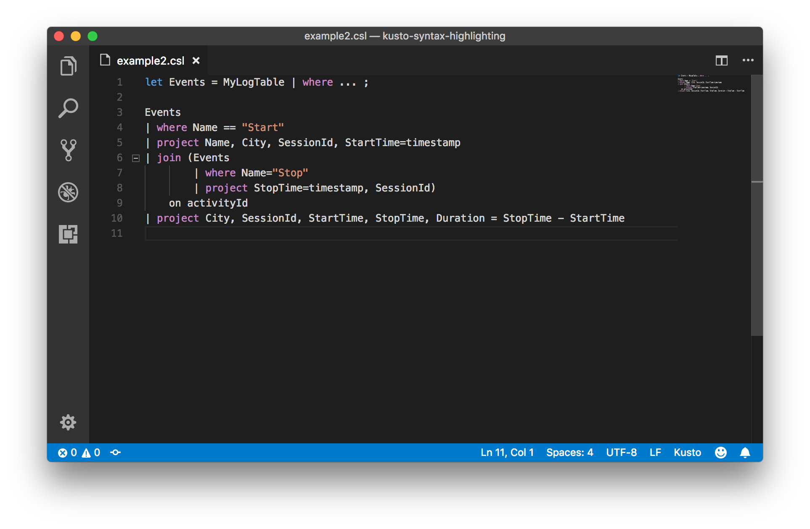

# Kusto (KQL) Language Support for VS Code

[](https://marketplace.visualstudio.com/items?itemName=josin.kusto-syntax-highlighting)
[](https://marketplace.visualstudio.com/items?itemName=josin.kusto-syntax-highlighting)
[](LICENSE)

Support for the **Kusto Query Language (KQL)** in Visual Studio Code. KQL is used in Azure Monitor, Azure Data Explorer, Microsoft Sentinel, and Microsoft Fabric. Includes syntax highlighting and the ability to run queries directly against an Azure Data Explorer cluster.

## Features

- **Syntax highlighting** for `.csl`, `.kusto`, and `.kql` files
- **Tabular operators**: `where`, `summarize`, `project`, `project-away`, `join`, `union`, `extend`, `render`, `parse`, `mv-apply`, `evaluate`, and more
- **Scalar functions**: string, math, datetime, geo, IP, array, dynamic bag functions (500+)
- **Aggregation functions**: `count`, `dcount`, `sum`, `avg`, `percentile`, `make_list`, `make_set`, and more
- **Data types**: `bool`, `datetime`, `dynamic`, `guid`, `int`, `long`, `real`, `string`, `timespan`
- **Comment toggling** (`//` line comments, `/* */` block comments)
- **Bracket matching** and **auto-closing pairs** for `{}`, `[]`, `()`
- **Code folding** via `// #region` / `// #endregion` markers
- **Smart indentation** inside `{}` blocks
- **Run queries** against an Azure Data Explorer (Kusto) cluster without leaving VS Code
- Supports **Azure CLI**, **interactive browser**, and **managed identity** authentication

## Example

```kusto
// Query the last hour of errors from AppTraces
let timeRange = 1h;
AppTraces
| where TimeGenerated > ago(timeRange)
| where SeverityLevel >= 3
| summarize ErrorCount = count(), LastSeen = max(TimeGenerated) by Message
| order by ErrorCount desc
| take 20
```



## File Associations

The extension activates automatically for files with these extensions:

| Extension | Description |
|-----------|-------------|
| `.kql` | KQL query files |
| `.kusto` | Kusto query files |
| `.csl` | Kusto control sequence files |

To manually set the language for an open file, use the **Select Language Mode** command (`Ctrl+K M`) and choose **Kusto**.

## Run Kusto Queries

You can execute Kusto queries directly from VS Code against an Azure Data Explorer (Kusto) cluster. Results are displayed in the **Kusto Results** output panel.

### Prerequisites

- **VS Code** 1.75.0 or later
- An **Azure Data Explorer** cluster you have access to
- For `AzureLogin` mode (default): the [Azure CLI](https://learn.microsoft.com/en-us/cli/azure/install-azure-cli) installed and signed in

### Step 1 — Configure the Extension

Open **Settings** (`Ctrl+,` / `Cmd+,`) and search for `kusto`, or add the following to your User or Workspace settings JSON (`settings.json`):

```jsonc
{
    // Required: the full URL of your Azure Data Explorer cluster
    "kusto.clusterUrl": "https://mycluster.kusto.windows.net",

    // Required: the database to run queries against
    "kusto.database": "MyDatabase",

    // Optional: authentication method (default: AzureLogin)
    // Options: "AzureLogin" | "InteractiveLogin" | "ManagedIdentity"
    "kusto.loginMode": "AzureLogin"
}
```

> **Tip:** Use **workspace** settings (`.vscode/settings.json`) to keep cluster details local to a specific project, keeping your global User settings clean.

### Step 2 — Authenticate

Choose the authentication method that fits your environment:

| Login Mode | When to Use | Setup Steps |
|---|---|---|
| `AzureLogin` *(default)* | Local development with Azure CLI | Run `az login` in a terminal once |
| `InteractiveLogin` | No Azure CLI; browser available | No setup — a browser window opens automatically |
| `ManagedIdentity` | Azure-hosted VMs / containers | Ensure a system-assigned managed identity is enabled on the host |

**For `AzureLogin`** (recommended for local development):

```bash
# Sign in to Azure once — the extension reuses these credentials
az login

# If you have multiple subscriptions, set the one that contains your cluster
az account set --subscription "<subscription-name-or-id>"
```

### Step 3 — Write and Run a Query

1. Create or open a file with the `.kusto`, `.kql`, or `.csl` extension.
2. Write your Kusto query, for example:

   ```kusto
   StormEvents
   | where StartTime >= ago(7d)
   | summarize Count = count() by EventType
   | order by Count desc
   | take 10
   ```

3. Run the query using any of these methods:

   | Method | Action |
   |--------|--------|
   | **Keyboard shortcut** | `Ctrl+Alt+E` (`Cmd+Alt+E` on macOS) |
   | **Editor toolbar** | Click the **▶** button in the top-right of the editor |
   | **Right-click menu** | Right-click in the editor → **Kusto: Run Query** |
   | **Command Palette** | `Ctrl+Shift+P` → type `Kusto: Run Query` |

4. Results appear in the **Kusto Results** output channel at the bottom of the editor.

### Configuration Reference

| Setting | Type | Default | Description |
|---------|------|---------|-------------|
| `kusto.clusterUrl` | `string` | `""` | Full URL of the Azure Data Explorer cluster, e.g. `https://mycluster.kusto.windows.net` |
| `kusto.database` | `string` | `""` | Name of the database to run queries against |
| `kusto.loginMode` | `string` | `"AzureLogin"` | Authentication method: `AzureLogin`, `InteractiveLogin`, or `ManagedIdentity` |

### Troubleshooting

**"Kusto cluster URL is not configured"**  
Set `kusto.clusterUrl` in Settings and make sure it is not empty.

**"Kusto database is not configured"**  
Set `kusto.database` in Settings and make sure it is not empty.

**Authentication errors with `AzureLogin`**  
Run `az login` in a terminal. If you have multiple tenants, use `az login --tenant <tenant-id>`.

**"Forbidden" / 403 errors**  
Your account does not have the required permissions on the cluster or database. Ask your cluster administrator to grant you at minimum the **Viewer** role on the target database.

## Bugs & Contributions

Found a bug or have a feature request? Open an issue in the [GitHub repository](https://github.com/josin/kusto-syntax-highlighting/issues).

Pull requests are welcome!
